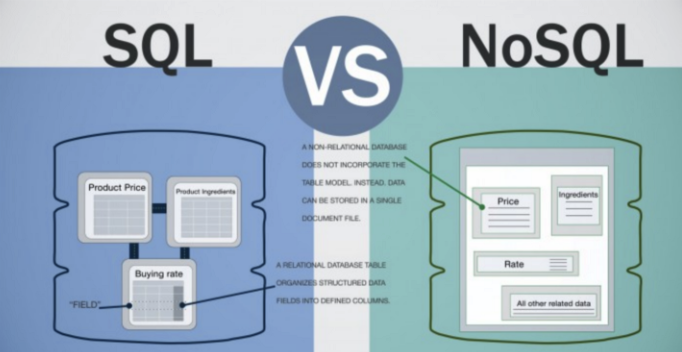
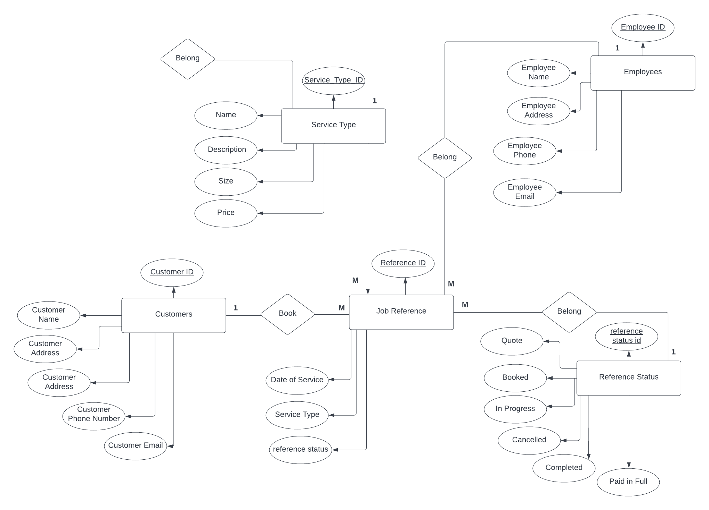
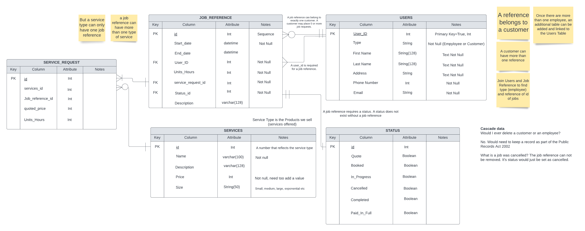
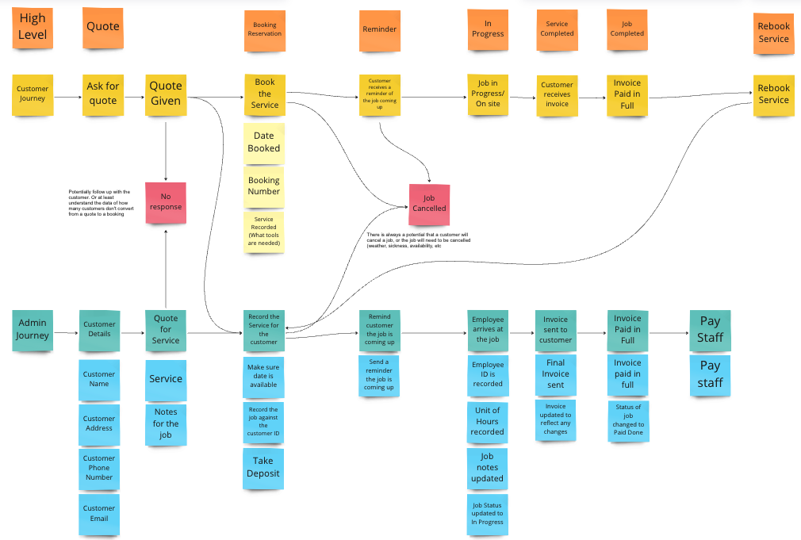

# T2A2 - API Webserver Project

Project: An admin portal for a start up Landscaping Business.

1. [Link to Project Documentation](https://docs.google.com/document/d/1_dzeT4baEx9C4u5cQbMgJiJ_pbRsguKYKNvxqlA5ojc/edit?usp=sharing)

2. [Link to Project Tracking (Trello)](https://trello.com/invite/b/06cHHz3x/ATTI6045b9cf1328ade946408c89e0871c76D3A87865/api-web-server-project)

3. [Virtual WhiteBoard](https://miro.com/app/board/uXjVPVaYOmE=/)

4. [Github](https://github.com/KatrinaTom/T2A2)

____________________________________

## Table of Contents

### Project Overview 
* [Introduction](#introduction)
* [Brief](#brief)

### Project Planning
With the use of Trello, the project is tracked in Phases

[Phase 1: Design of Database](#phase1)

* [Requirement 1](#req1)
* [Requirement 2](#req2)
* [Requirement 3](#req3)
* [Requirement 4](#req4)
* [Requirement 5](#req5)
* [Requirement 6](#req6)
* [Requirement 7](#req7)
* [Requirement 8](#req8)
* [Requirement 9](#req9)
* [Requirement 10](#req10)

[User Story Mapping - Customer Journey](#journey)

[Phase 2: Software Development Plan](#phase2)

1. [Database Creation](#database)
2. [Set Up (incl. Third Party Dependencies)](#setup)
3. [Development](#development)
4. CRUD (Create, Read, Update, Delete)
5. Authorisation and Authentication
6. Validation and Error Handling
7. Testing
8. Deployment

### Resources
* Important Links
* References

____________________________________

# Project Overview

## Introduction<a name="introduction"></a>
To solidify your knowledge of core web server concepts and show your ability to work with web servers at a fundamental level, you should be able to write code to create a functioning web API server.

## Brief<a name="brief"></a>
Design a functioning web server in the relevant programming language. Your web server must contain valid, functioning code and adhere to the following requirements:

**Requirements**

1. Planning
2. Code

____________________________________

# Project Planning
[Link to Project Tracking (Trello)](https://trello.com/invite/b/06cHHz3x/ATTI6045b9cf1328ade946408c89e0871c76D3A87865/api-web-server-project)

## Phase 1: Design of Database<a name="phase1"></a>

**Documentation Requirements**

Complete a planning stage before developing the application, which requires the development of these items:
* An entity relationship diagram (ERD) that represents the normalised relational database to be used in this web server
* An explanation of the ERD, with reference to the models and associations to be used with the web server
* An explanation of the chosen database system, including comparisons to other types of database systems
* A software development plan


## Requirement 1<a name="req1"></a>
**Identification of the problem you are trying to solve by building this particular app.**

Recently I have picked up the hobby of gardening.
The opportunity I want to create is to start a side business where I can offer my services of maintaining a garden for someone else.

The **problem** I want to solve with the API Webserver Project is to build an Admin portal for a Landscaping business.

"As a Business Owner

I want to create a admin portal for a Landscaping business

So that I can track customers, jobs and invoicing"

## Requirement 2<a name="req2"></a>
**Why is it a problem that needs solving?**

There are other methods to start a customer database, however I can imagine it would create more problems in the future as the business grows.
If I did not create a database, It would be difficult to expand. Such as tracking customers, add staff and invoicing would be very difficult and time consuming.

To make sure I am on the right track that this is a problem that needs solving, I asked myself (as the potential business owner) the following question:

“How will I use this API?”.

What does it need to do? Below is a list of requirements.

**Landscaping Business - Build a API Web Server Admin Portal:**

* Log in (securely) - To protect myself and my customer information.
* Enter in a new customer
* Search for an existing customer
* Book a job for a customer
* Select the type of job for the customer
* Add a new user to access the Admin Portal
* Update a job (update/ cancel)
* Invoice a customer from their completed job

Already from the list above, if this was done manually, it would create human errors.

This is a problem I want to solve as a future business owner that expects this business to grow successfully and ensure privacy/security of data.

## Requirement 3<a name="req3"></a>
**Why have you chosen this database system. What are the drawbacks compared to others?**

The chosen database for this project is a **Relational Database Management System**.

Reason for this type of database is that it is characterized by its intuitive relationships of representing data in tables. Especially for a business where the importance of data integrity is integral.

However without reviewing other types of databases I wouldn’t have been able to come to this conclusion.

A comparison between a Relational Database Management System and a Non-Relational Database Management System, the only drawback I could find is the potential complexity of a relational database. Especially when it comes to storing data in a tabular form, which can make it difficult to represent complex relationships between objects.



Image from Medium, 2020, "Document vs Relational Databases"

However there are more advantages in this case to use a Relational Database Management System than any other database management system due the nature of the data for this project.

## Requirement 4<a name="req4"></a>
**Identify and discuss the key functionalities and benefits of an ORM**

ORM, Object Relational Mapping refers to a library that implements the technique to write the query in your chosen programming language rather than relying on SQL to execute a query.

Even though there is still a need for a fundamental understanding of SQL and databases when using an ORM.

Benefits of an ORM are:

* Works with Python objects
* Allows you to switch your database easily
* Allows you to control the structure of your datbase from your code, which can be managed by revision control system like Git.
* That you can write in your chosen programming language. In this case using Python as the Programming Language.
* Abstracts away from the database system so that there is no need to switch from MySQL to PostgreSQL.
* There are a lot of advanced features that support transactions, connection pooling, migratations, and seeds as an example.
  
In this project, the ORM we will be using is **SQLAlchemy**.

## Requirement 5<a name="req5"></a>
**Document all endpoints for your API**

...

## Requirement 6<a name="req6"></a>
**An ERD for your app**

Entities is an object or concept about which you want to store information and that is to be represented in the database.

Below is the Entity Relational Diagram demonstrating the entity relationships. This is the first attempt before Normalisation.



Cardinality defines the numerical attributes of the relationship between two entities.

Different types of cardinal relationships are:
* One-to-One Relationships
* One-to-Many Relationships
* Many-to-Many Relationships

In the above screenshot, the number 1 indicates a one to many relationship where the "M" displays.

**Cardinality**

1. Customers book a Service
- Customers book Services that requires a Reference Id (to track the status) (One-to-Many relationship)
- A customer can request multiple quotes, or have a quote and a job in progress or completed.
- There can only be one Reference of a job per customer

2. Service_Type (lawn care/garden care) belong to a Reference of a Job
- A Service belongs to a Reference of the Job (For the customer). 
- A customer can requesr lawn care and or garden care.
- One to many (One service (lawn care and or garden care) on the Reference of the job, otherwise it becomes another job.

3. Reference status belongs to a Reference of a job.
- A reference status can belong to a reference of a job, one at a time (this is a one to one relationship).
- A reference of a job can not be in progress and completed at the same time.
  
4. An Employee belongs to a Reference of a job
- An Employee belongs to a Reference of a job. 
- An employee can have a many-to-many relationship with reference of a job.
- An employee can quote a job and own that reference, they can be in progress of a job and then can have completed a job.


## Requirement 7<a name="req7"></a>
**Detail any third party services that your app will use**

...

## Requirement 8<a name="req8"></a>
**Describe your projects models in terms of the relationships they have with each other**

...

## Requirement 9<a name="req9"></a>
**Discuss the database relations to be implemented in your application**

Database Modeling

The second step of the database creation is the relational model. Transforming the ERD into tables so that the database can be created.

Each entity is going to be a table in the database and entity attributes are going to be the columns of that table.

**USERS**(__user_id__, type, first_name, last_name, address, phone_number, email)

**JOB_REFERENCE**(__reference_id__, start_date, end_date, user_id, service_request_id, units_hours, status_id, description)

**STATUS**(__status_id__, quote, booked, in_progress, canceled, completed, paid_in_full)

**SERVICES**(__service_type_id__, name, description, size, price)

**SERVICE_REQUEST**(__service_request_id__, services_id, jo_reference_id, quoted_price, units_hours)



The above image incorporates the practice of Normalisation to avoid data redundancy or duplicated data.

"Normalisation is a technique for organising data in a database."

Data has been separated into relevant and seperate tables, which are then related by keys. Such as Primary Keys (can only be one per table) and Foreign Keys that link to other tables.

Including a column to show the attribute types. It is a combination of Integers, Strings, Boolean values and character limits. This is to ensure data integrity by adding in constraints such as Not Null. 

In the above image, Crows Foot Notationw as used to demonstrate the relationship between the entities.

## Requirement 10<a name="req10"></a>
**Describe the way tasks are allocated and tracked in your project**

Through the use of a task management system called Trello, the project is tracked.

[Link to Project Tracking (Trello)](https://trello.com/invite/b/06cHHz3x/ATTI6045b9cf1328ade946408c89e0871c76D3A87865/api-web-server-project)

Split out into two Phases.

**Phase 1**

Is for Designing the API Web Server. Documenting requirements from 1 to 10. This is part of planning the project before Development can commence.

**Phase 2**

Is for Development of the API Web Server. With the foundations of the design clearly identified, the development can begin.

Tracking of the project includes:

Columns in Trello:

* High Level Project Requirements: All the other columns would need to be completed before these high level project requirements are marked as done. This would be considered the epics of the project.
* Phase 1 - Design Backlog: Initial steps of understanding what needs to be built and why. By working through these initial requirements, the project is understood and designed, database identified, documented and any additional requirements considered.
* Phase 2 - Development Backlog: With a focus on the OOP programming paradigm, this column is for development cards.
* In Progress: Actively working on the card in this column, to complete the acceptance criteria.
* Testing: During development, Test Driven Development is considered. The development cards include the testing so that it is a continuous process. Including unit testing and end to end testing manually as a sanity check/ regression testing.
* Completed/Done: All acceptance criteria in the card is marked as completed, then the card can be moved to this column and progress tracked.

## Story Mapping - Customer Journey<a name="journey"></a>

To understand the database, I looked at the customer experience and the ADMIN portal experience. Below is a screenshot of the User Story Mapping.



[Virtual WhiteBoard](https://miro.com/app/board/uXjVPVaYOmE=/)

____________________________________
  
# Development

## Phase 2: Software Development Plan<a name="phase2"></a>

An overview of this project is that it focuses on using the following:

* Database Management System (DBMS)
* Structured Query Language (SQL), Data Definition Lanauge (DDL) Data Manipulation Language (DML) that will run SQL queries. Data Control Language (DCL)
* Entity Relationship Diagram as seen in [Requirement 6](#req6). The first step in understanding the entities, attributes, relationships and cardinality
* Database Modelling as seen in [Requirement 9](#req9). Transforming the concepts from the inital ERD into a database model and expressing relationships and required information.
* Practice Data Normalisation to avoid data redundancy.
* Relational Database, use of PostgreSQL and create tables with SQL.
* Data Manipulation, SQL insert, simple queries, delete, update, alter tables
* Flask - web framework for making a web application (serve requests and responses)

## Database Creation<a name="database"></a>

Check for PostgreSQL

```postgres --version```

Access PostgreSQL

```psql```

Database Creation.

```CREATE DATABASE landscaping_admin_db;```

Check the list of databases

```\l```

Connect to database

```\c landscaping_admin_db```

Database connection

```pip3 install psycopg2```

```pip3 install flask-SQLAlchemy```

Configure in main.py

...

Create a Model

Example in SQL

**USERS**(__user_id__, type, first_name, last_name, address, phone_number, email)

```CREATE TABLE USERS (
user_id integer PRIMARY KEY,
user_type text NOT NULL,
user_first_name text NOT NULL,
user_last_name text NOT NULL,
user_address text NOT NULL,
user_phone_number integer NOT NULL,
user_email text NOT NULL);
```

```ALTER TABLE USERS
ADD PRIMARY KEY user_id;
```

## Set Up (incl. Third Party Dependencies)<a name="setup"></a>

Create a virtual environment and activate it

```python3 -m venv .venv && source .venv/bin/activate```

Great a gitignore folder, main.py filder and a requirements.txt file

Install Flask

```pip3 install flask```

Set up a basic Flask app in the main.py file and test that initially it works.

## Development<a name="development"></a>

1. Using an ORM - Install Flask-SQLAlchemy

```pip3 install Flask-SQLAlchemy```


...

1. CRUD (Create, Read, Update, Delete)
2. Authorisation and Authentication
3. Validation and Error Handling
4. Testing
5. Deployment