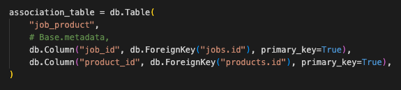
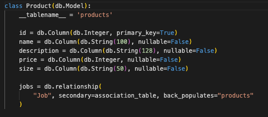

# Database Design<a name="db"></a>

* [Req 1: Identify the problem](#req1)
* [Req 2: Why is it a problem?](#req2)
* [Req 3: Database Comparison](#req3)
* [Req 4: Benefits of a ORM](#req4)
* [Req 5: API Endpoint Documentation](#req5)
* [Req 6: ERD](#req6)
* [Req 7: Third Parties - Library](#req7)
* [Req 8: Relationships to Models](#req8)
* [Req 9: Database Relations](#req9)
* [Req 10: Project Tracker](#req10)

**Documentation Requirements**

Complete a planning stage before developing the application, which requires the development of these items:

* An entity relationship diagram (ERD) that represents the normalised relational database to be used in this web server
* An explanation of the ERD, with reference to the models and associations to be used with the web server
* An explanation of the chosen database system, including comparisons to other types of database systems
* A software development plan


# Requirement 1:<a name="req1"></a>

**Identification of the problem you are trying to solve by building this particular app.**

Recently I have picked up the hobby of gardening.

The **problem** I want to solve with the API Webserver Project is to build an Admin portal for a Landscaping business.

This is to capture Customer Data, Product Data and use this data to track a Lanscaping job.

# Requirement 2<a name="req2"></a>

**Why is it a problem that needs solving?**

To make sure that this is a problem that needs solving, I asked myself the following question:

“How will this API be used?"

What does it need to do? Below is a list of requirements.

* Secure customer information.
* Add a new customer
* Search for an existing customer
* Book a job for a customer
* Search a job in the database
* Select the type of job for the customer
* Update a job (update/ cancel)

From the above list there is alot complexity that would benefit with an api webserver.

# Requirement 3<a name="req3"></a>

**Why have you chosen this database system. What are the drawbacks compared to others?**

The chosen database for this project is a **Relational Database Management System**.

Reason for this type of database is that it is characterized by its intuitive relationships of representing data in tables. Especially for a business where the importance of data integrity is integral.

However without reviewing other types of databases I wouldn’t have been able to come to this conclusion.

A comparison between a Relational Database Management System and a Non-Relational Database Management System, the only drawback I could find is the potential complexity of a relational database. Especially when it comes to storing data in a tabular form, which can make it difficult to represent complex relationships between objects.


Image from Medium, 2020, "Document vs Relational Databases"

However there are more advantages in this case to use a Relational Database Management System than any other database management system due the nature of the data for this project. The main advantages is that data can be related to each other.

# Requirement 4<a name="req4"></a>

**Identify and discuss the key functionalities and benefits of an ORM**

ORM, Object Relational Mapping refers to a library that implements the technique to write the query in your chosen programming language rather than relying on SQL to execute a query.

Even though there is still a need for a fundamental understanding of SQL and databases when using an ORM.

Benefits of an ORM are:

* Works with Python objects (this web application is built using Python)
* Allows you to switch your database
* Allows you to control the structure of your datbase from your code, which can be managed by revision control system like Git.
* That you can write in your chosen programming language. In this case using Python as the Programming Language.
* Abstracts away from the database system so that there is no need to switch from MySQL to PostgreSQL.
* There are a lot of advanced features that support transactions, connection pooling, migratations, and seeds as an example.
* Helps prevent SQL injection due to not working directly with the database (postgreSQL). Security of the database.
  
In this project, the ORM I will be using is **SQLAlchemy**.

# Requirement 5<a name="req5"></a>

**Document all endpoints for your API**

[API Endpoint Documentation](/docs/images/Documentation/API_Endpoints.md)

# Requirement 6<a name="req6"></a>
**An ERD for your app**

Entities is an object or concept about which you want to store information and that is to be represented in the database.


Cardinality defines the numerical attributes of the relationship between two entities.

Different types of cardinal relationships are:
* One-to-One Relationships
* One-to-Many Relationships
* Many-to-Many Relationships

In the above image, Crows Foot Notationw as used to demonstrate the relationship between the entities.

# Requirement 7<a name="req7"></a>

**Detail any third party services that your app will use**

**Flask**

Is a lightweight WSGI web application framework in Python. It is designed to make getting started very quickly and very easily.

**Marshmallow**

Is an ORM/ODM/framework-agnostic library for converting complex datatypes, such as objects, to and from native Python datatypes.

**Flask-Marshmallow** 

Is a thin integration layer for Flask and marshmallow that adds additional features to marshmallow.

**SQLAlchemy**

Is the Python SQL toolkit and Object Relational Mapper that gives application developers the full power and flexibility of SQL.

**Database connection**

Psycopg2 connects the database (psql with sqlalchemy)

```pip3 install psycopg2```

**Flask-SQLAlchemy**

Is an extension for Flask that adds support for SQLAlchemy to your application. It aims to simplify using SQLAlchemy with Flask.

**marshmallow-sqlalchemy**

Flask-Marshmallow is an integration layer for Flask that will allow for object serialisation/deserialization library. Integrated with SQLAlchemy.

**pipenv**

As the dependency manager. This is located in the .env.sample file as a reference to what is required.

**Flask-Bcrypt** 

A Flask extension that provides bcrypt hashing utilities for passwords.

**JWT Flask Extended**

A Flask extenstion for JWT Manager (authentication), allowing for token creation and authentication.

## Set Up (incl. Third Party Dependencies)<a name="setup"></a>

Create a virtual environment and activate it

```python3 -m venv .venv && source .venv/bin/activate```

Great a gitignore folder, main.py filder and a requirements.txt file

Install Flask

```pip3 install flask```

Set up a basic Flask app in the main.py file and test that initially it works.

# Requirement 8<a name="req8"></a>

**Describe your projects models in terms of the relationships they have with each other**

**Cardinality**

Job and User (one-to-many relationship)

* One user can belong to many jobs
* A job can have one user

Job and Product (one-to-many relationship)

* One product can belong to many jobs
* A job can have many products

Job_Product and Product (one-to-many relationship)

* a job_product can have many products
* a product can only belong to one job_product for a job

# Requirement 9<a name="req9"></a>

**Discuss the database relations to be implemented in your application**

Each entity is in a table in the database and entity attributes are in the columns of that table.

**USER**(__id__, type, first_name, last_name, address, phone_number, email, password, is_admin)


Fields are nullable, limit to character length. To protect the database an is_admin field is only resonsible for CRUD operations.

**JOB**(__id__, user_id, job_product_id, status, start_date, end_date, units_hours, description)


Jobs table has two foreign keys (user_id and job_product_id). This is joined through an association table.



**PRODUCT**(__id__, name, description, price, size)



Data has been separated into relevant and seperate tables, which are then related by keys. Such as Primary Keys (can only be one per table) and Foreign Keys that link to other tables.

Including a column to show the attribute types. It is a combination of Integers, Strings, Boolean values and character limits. This is to ensure data integrity by adding in constraints such as Not Null.

Normalisation was considered and the next step would be to normalised the column. However for this project and the MVC structure, this can be completed at a later time for marketing purposes.

## Requirement 10<a name="req10"></a>

**Describe the way tasks are allocated and tracked in your project**

Through the use of a task management system called Trello, the project is tracked.

[Link to Project Tracking (Trello)](https://trello.com/invite/b/06cHHz3x/ATTI6045b9cf1328ade946408c89e0871c76D3A87865/api-web-server-project)

Split out into two Phases.

**Phase 1**

Is for Designing the API Web Server. Documenting requirements from 1 to 10. This is part of planning the project before Development can commence.

**Phase 2**

Is for Development of the API Web Server. With the foundations of the design clearly identified, the development can begin.

Tracking of the project includes:

Columns in Trello:

* High Level Project Requirements: All the other columns would need to be completed before these high level project requirements are marked as done. This would be considered the epics of the project.
* Phase 1 - Design Backlog: Initial steps of understanding what needs to be built and why. By working through these initial requirements, the project is understood and designed, database identified, documented and any additional requirements considered.
* Phase 2 - Development Backlog: With a focus on the OOP programming paradigm, this column is for development cards.
* In Progress: Actively working on the card in this column, to complete the acceptance criteria.
* Testing: During development, Test Driven Development is considered. The development cards include the testing so that it is a continuous process. Including unit testing and end to end testing manually as a sanity check/ regression testing.
* Completed/Done: All acceptance criteria in the card is marked as completed, then the card can be moved to this column and progress tracked.


Example of a Card in Trello


## Story Mapping - Customer Journey<a name="journey"></a>

To understand the database, I looked at the customer experience and the ADMIN portal experience. Below is a screenshot of the User Story Mapping.


[Virtual WhiteBoard](https://miro.com/app/board/uXjVPVaYOmE=/)

Any feedback, please don't hesitate to reach out. 

[Link to the Top of Page](#db)